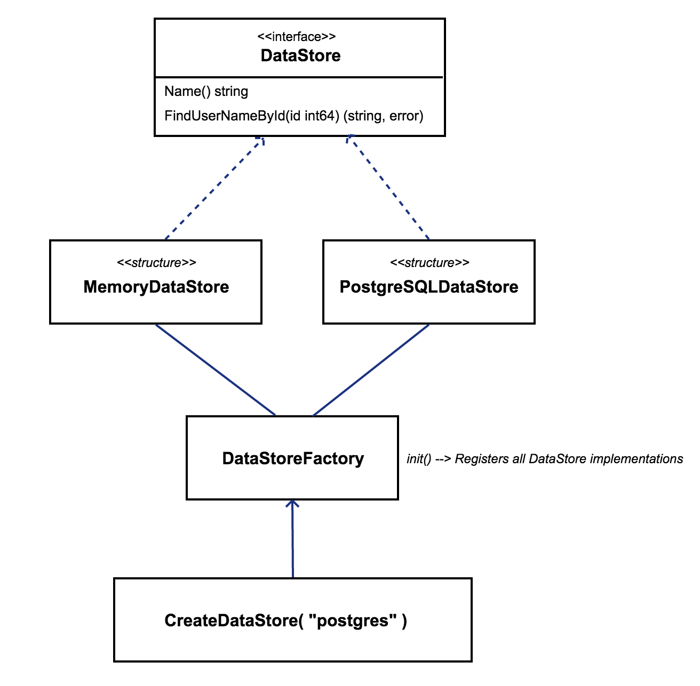

# Factory Method

## Definition
Here the definition from Wikipedia:

> The `Factory Method Pattern` is a creational pattern that uses factory methods to deal with the problem of creating objects without having to specify the exact class of the object that will be created. 

## Objectives

- Delegating the creation of new instances of structures
- Working at the interface level instead of with concrete implementations
- Grouping families of objects to obtain a family object creator

## Example
This example is taken from Matthew Brown, see the references below. It has the following components: `DataStore`, `MemoryDataStore`, `PostgreSQLDataStore` and `DataStoreFactory`.




### DataStore
`DataStore` is an interface that defines the following methods:
```go
type DataStore interface {
    Name() string
    FindUserNameById(id int64) (string, error)
}
```

### DataStore implementations
`MemoryDataStore` and `PostgreSQLDataStore` are implementations of the `DataStore` interface. They both contains the `Name` and `FindUserNameById` methods, as well as the factory method for constructing the specific `DataStore` implementation.

Let's see for example the `PostgreSQLDataStore`:

```go
type PostgreSQLDataStore struct {
    DSN string
    DB  sql.DB
}

// factory method that return the common interface DataStore
func NewPostgreSQLDataStore(conf map[string]string) (DataStore, error) {
    dsn := ""
    ok := false
    if dsn, ok = conf["DATASTORE_POSTGRES_DSN"]; !ok {
        return nil, errors.New(fmt.Sprintf("%s is required for the postgres datastore", "DATASTORE_POSTGRES_DSN"))
    }
    db, err := sqlx.Connect("postgres", dsn)
    if err != nil {
        log.Panicf("Failed to connect to datastore: %s", err.Error())
        return nil, fmt.Errorf("Failed to connect to datastore: %s", err.Error())
    }

    return &PostgreSQLDataStore{
        DSN: dsn,
        DB:  *db.DB,
    }, nil
}

func (pds *PostgreSQLDataStore) Name() string {
    return "PostgreSQLDataStore"
}

func (pds *PostgreSQLDataStore) FindUserNameById(id int64) (string, error) {
    var username string
    rows, err := pds.DB.Query("SELECT username FROM users WHERE id=$1", id)
    if err != nil {
        return "", fmt.Errorf("error executing query: %v", err)
    }

    err = rows.Scan(&username)
    if err != nil {
        if err == sql.ErrNoRows {
            return "", errUserNotFound
        }
        return "", err
    }
    return username, nil
}
```

### DataStoreFactory
The `DataStoreFactory` handles the registering and storage of the factory methods. 
This component has all the necessary to instanciate any of the registered `DataStore`
but will be the `CreateDatastore` the responsible to decide which concrete `DataStore`
will be used.

```go

// DataStoreFactory is a type that defines factory method
type DataStoreFactory func(conf map[string]string) (DataStore, error)

// datastoreFactories is the variable for storing the factory methods
var datastoreFactories = make(map[string]DataStoreFactory)

// Register adds a new DataStore implementation into the datastoreFactories variable
func Register(name string, factory DataStoreFactory) {
    if factory == nil {
        log.Panicf("Datastore factory %s does not exist.", name)
    }
    _, registered := datastoreFactories[name]
    if registered {
        log.Printf("Datastore factory %s already registered. Ignoring.", name)
    }
    datastoreFactories[name] = factory
}

func init() {
    Register("postgres", NewPostgreSQLDataStore)
    Register("memory", NewMemoryDataStore)
}
```

### DataStore Creation
Finally we define a function for creating an instance of the requested `DataStore`:

```go
func CreateDatastore(conf map[string]string) (DataStore, error) {
    var engineName string
    var ok bool

    // Query configuration for datastore, by default is "memory".
    if engineName, ok = conf["DATASTORE"]; !ok {
        engineName = "memory"
    }

    engineFactory, ok := datastoreFactories[engineName]
    if !ok {
        // Factory has not been registered.
        return nil, fmt.Errorf("Invalid Datastore name. Must be one of: %s", strings.Join(listAllDataStoreFactories(), ", "))
    }

    // Run the factory with the configuration.
    return engineFactory(conf)
}
```


## References
- [Factory Method Pattern](https://en.wikipedia.org/wiki/Factory_method_pattern) from Wikipedia
- [The factory method pattern in Go](https://matthewbrown.io/2016/01/23/factory-pattern-in-golang/) by Matthew Brown.
- [Desing Patterns in Golang: Factory Method](http://blog.ralch.com/tutorial/design-patterns/golang-factory-method/) by Svetlin Ralchev.